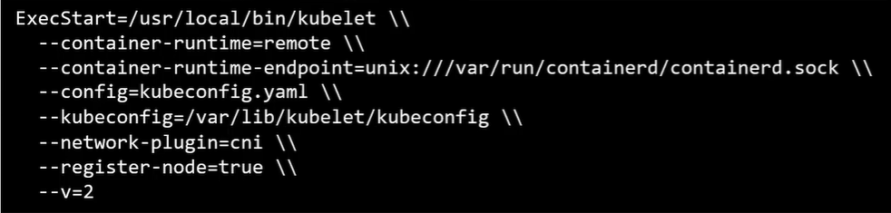
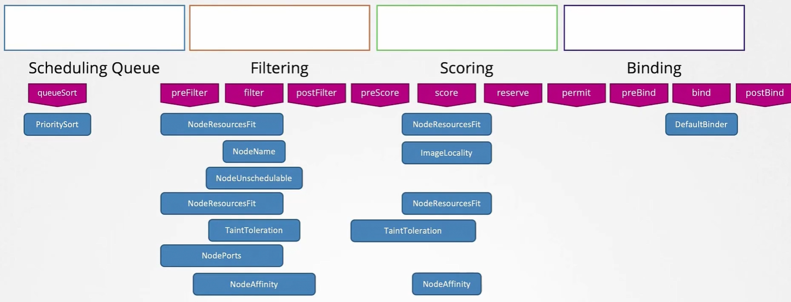
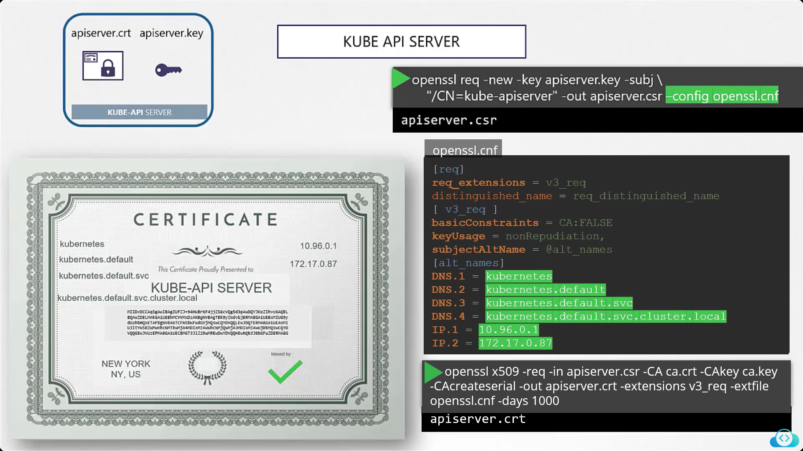

# KCNA

### Cloud Native
- DevOps + Microservices + Cloud Native Open Standards + Containers.

### Cloud Native Computing Foundation (CNCF)
- A project by Linux Foundation launched in 2015 to help advance container technology.
- Independent organization from its parent.

### Cloud Native Trail Map


1. Containerization
2. Continuous Integration and Deployment (CI/CD)
3. Orchestration and Application Definition
4. Observability and Analysis
5. Service Proxy, Discovery & Mesh
6. Network Policy & Security
7. Distibuted Databases & Storage
8. Streaming & Messaging 
9. Container Registry & Runtime
10. Software Distribution

- `Etcd` is fully replicated in every master node.
- Kube Api Server makes a master a master.
- Kubelet makes a worker a worker (however it is present on master too).

- Kubelet communicates to the master via API server.
### To get more info about cluster:
```bash 
    kubectl cluster-info
```

### Container Runtime
- Need of Container Runtime emerged when other tools apart from Docker came into the market.
- For a Container Runtime to be compatible with Kubernetes, it must be Open Container Initiative (OCI) compatible.
- OCI compatible CRI contains `imagespec` and `runtimespec`.
- `Dockershim` provided temporary layer for Kubernetes to support docker.

### Kubelet and CRI Communication using gRPC
- CRI defines `gRPC` protocol that Kubernetes kubelet uses to interact with container runtimes.
- Kubelet utilizes gRPC as the primary communication protocol to interact with the Container Runtime Interface (CRI).
 

### Docker and Kubernetes
- Docker support from Kubernetes was removed in 1.24.
- Dockershim was basically removed.
- `ContainerD`, that powered Docker, now works directly with Kubernetes.
- Docker primarily uses `LXC` container technology.

### ContainerD and CLI
- Comes with commandline tool `ctr` for debugging, has limited functionality.
- However, `nerdctl` provided a Docker-like CLI for ContainerD and supports Docker Compose.
- Nerdctl also supports new features and implementations of containerd.
- Supports Lazy Pulling.
> 😃 "Lazy pulling" in Kubernetes refers to a technique where a container image is not fully downloaded from a registry before a container is launched; instead, only the necessary parts of the image are pulled on-demand as they are needed during runtime, significantly reducing startup time and optimizing resource usage.

### crictl (installed separately) - Managed by Kubernetes Community
- A command-line tool for managing Kubernetes container runtimes that implement the Container Runtime Interface (CRI), such as containerd and CRI-O.
- Used for debugging and troubleshooting Kubernetes nodes by inspecting containers, pods, images, and logs without relying on kubectl.
- Uses **/etc/crictl.yaml** for runtime settings, typically pointing to a `CRI runtime socket` (e.g., /run/containerd/containerd.sock for containerd).
- Kubelet will delete containers that are manually created with crictl since it would be unaware of such containers.
> A container runtime socket is a Unix domain socket file that facilitates communication between the Kubernetes kubelet and the underlying container runtime.

### YAML ApiVersions & Indentation
- Pod = v1
- Service = v1
- ReplicaSet = apps/v1
- Deployment = apps/v1

> HINT: Prefer using two spaces for indentation instead of tab.

### Kubernetes: ReplicationController vs ReplicaSet
- Major difference is `selector` being required in ReplicaSet, not in Replication controller.
- Yes, you can manage replications of other pods that are not created by ReplicaSet but have matching label for selector.
- Labels in spec->selector->matchLabels === spec->template->metadata->labels
> TERMINATION STATE: ReplicaSet does not allow the manual creation of pod with same label as pods realted to that RS.
> Doing so will terminate newly created pod if the desired number of replicas are already running.

### Kubectl Replace
- Works like apply command, but recreates the resouce than making changes to existing one.
- Can be considered if working with ingress, secrets, and/or storage resources.

```bash
    kubectl replace -f ingress.yaml
```
### Rolling Updates in Deployments
- Pods are replaced by new ones, one by one, with no application downtime.
- Kubernetes creates a new ReplicaSet and keeps creating new pods there and doing the opposite in older ReplicaSet.
- `Undo` command does the opposite of second point mentioned. Upon execution, it starts creating pods in old ReplicaSet while deleting pods from the recent one.
- There can be more than one or two ReplicaSets present for each deployment, supporting cascading rollbacks.
- Commands

```bash
    kubectl rollout status deployment/my-deployment
    kubectl rollout history deploy my-deployment
    kubectl rollout undo deploy my-deployment
```

### Listing Resources Present in All Namespaces
```bash
    kubectl get pods --all-namespaces
```

### Resource Qoutas in Kubernetes

### Accessing Resources Residing in Other Namespaces
- The format will be `resourceName.namespaceName.resourceType.cluster.local`.

### Manual Scheduling
- Specify `spec->nodeName` field to manually schedule the pod on a specic node.
- To schedule an **existing pod** to a node, create a `Binding` object having meatadata.name value equal to metadata.labels.name in pod definition. Then sent a POST request to the pod's binding API containing JSON file obtained after converting binding object YAML to JSON. 
- A `binding object` refers to a specific type of resource that is used to link a Pod to a particular node within the cluster.
> Using nodeName spec will ignore scheduler, i.e, manual scheduling using nodeName property will work even scheduler component in control-plane stopped.

### Labels and Selectors in Kubernetes
- Labels are used to group or identify resources and selectors are used to select resources with specific labels.
```bash
    kubectl get pods --selector app=App1
```

### Taints & Tolerations
- Taints are used for nodes
```bash
    kubectl taint nodes <nodename> key=value:taint-effect
```
- **Taint Effects:** NoSchedule, PreferNoSchedule, NoExecute
- Tolerations are applied on pods.
```yaml
# add this in pod manifest.
spec:
  tolerations:
  - key: "app"
    operator: "="
    value: "blue"
    effect: "No Schedule"

```
- Adding No Schedule taint on a node having running pods will cause pods with no supported tolerations to evict.
- There are changes of a pod having matching tolerations get scheduled to another node as taints only make nodes to only schedule pods with matching tolerations.
- To find taints on master node:
``` bash
    kubectl describe node kubemaster | grep Taint
```

### Node Selectors
- Proivde another approach for scheduling by adding `nodeSelector` property in pod yaml file spec.
- This value must match with the label assigned to the node(s) to get that pod scheduled on that node.
- To label a node:
```bash
    kubectl label nodes <node-name> <label-key>=<label-value>
```
- In pod manifest:
```yaml
spec:
  nodeSelector:
    <label-key>: <label-value>
```
- NodeSelector only allows you to select nodes with lables, it will not provide conditional selection or more flexible selection.
> NOTE: You must label node(s) before scheduling pods on them.

### Node Affinity:
- Node affinity supports expressions like In, NotIn, Exists, for scheduling.
- Provides more features compared to NodeSelectors.
- Ensures correct scheduling compared to Taints and Tolerations where a pod with tolerations can end up being scheduled at node with no any taint.
- The syntax looks like this:
```yaml
spec:
  affinity:
    nodeAffinity:
      requiredDuringSchedulingIgnoredDuringExecution:
        nodeSelectorTerms:
        - matchExpressions:
          - key: topology.kubernetes.io/zone
            operator: In
            values:
            - antarctica-east1
            - antarctica-west1
      preferredDuringSchedulingIgnoredDuringExecution:
      - weight: 1
        preference:
          matchExpressions:
          - key: another-node-label-key
            operator: In
            values:
            - another-node-label-value
```
> You can use Tains & Tolerations and Affinty for more customized scheduling.

### Resource Requests and Limits
- CPU resources in Kubernetes are specified in cores or millicores, where 1 core equals 1000m, allowing fine-grained control over resource allocation; CPU is compressible, meaning containers can exceed requests if extra capacity is available.
- Memory resources are defined using binary (Mi, Gi) or decimal (M, G) units, with binary units using powers of 2 `(1Gi=1024Mi)` and decimal units using powers of 10 `(1G=1000M)`; memory is non-compressible, and exceeding limits results in container termination.
- Resource requests define the minimum guaranteed allocation for a container, while limits set the maximum usage allowed; exceeding CPU limits leads to throttling, whereas exceeding memory limits causes the container to be killed with `OOM (Out of Memory)` error.
- Using requests only (for CPU), can be a good approach since it guarantees requested resources to pods with flexibility of providing them more if needed and available, unlike limits.
- `LimitRange` objects are used to define default limits and requets, sample code:
```yaml
apiVersion: v1
kind: LimitRange
metadata:
  name: resource-limits
  namespace: default
spec:
  limits:
  - type: Container
    default:
      cpu: "1"
      memory: "512Mi"
    defaultRequest:
      cpu: "500m"
      memory: "256Mi"
    max:
      cpu: "2"
      memory: "1Gi"
    min:
      cpu: "100m"
      memory: "128Mi"
```
> These limit ranges are only appied to new pods after application.

### Resource Quotas
- A ResourceQuota enforces resource constraints at the namespace level, limiting the total number of pods and the overall CPU/memory usage across all workloads.
```yaml
apiVersion: v1
kind: ResourceQuota
metadata:
  name: namespace-quota
  namespace: default
spec:
  hard:
    pods: "10"
    requests.cpu: "2"
    requests.memory: "2Gi"
    limits.cpu: "4"
    limits.memory: "4Gi"
```

### DaemonSet
- Makes sure to run pod on each node.
- Defined with YAML code similar to that of a ReplicaSet, with kind DaemonSet.

### Static Pods
- Kubelet can can manage a node standalone, even without control-plane.
- Kubelet only undersandstores all the manifests of pods (ONLY) in `/etc/kubernetes/manifests` directory and regularly updates them.
- You can change the default manifest path by providing cmd params when running kubelet service, or this can be done by modifying the manifst and providing it into params.
- 
- Remember, kubectl commands will not work for pod management in the absense of control plane nodes. However, CRI specific commands can be used for debugging.
- Pods that are creating using these manifests stored by kubelet are called `static pods`.

### Kubelet and API Server
- Kubelet can create both, static pods and pods from API Server.
- Kube APIServer is aware of static pods too, as kubelet creates `mirror objects` of pods in APIServer.
- API Server provides pod definitions using HTTP protocol.

### Usecases (Static Pods)
- Control Plane Components (remember /etc/kubernetes/manifests on control plane containing manifests of control plane component pods).

> Static Pods and DaemonSet Pods are ignored by Kube-Scheduler.

### Multiple Schedulers
- You can extend functionality of the kube-scheduler.
- You can also write custom schedulers that can run standalone or in coordination with kube-scheduler.
- `spec.schedulerName` in pod manifest can be used to make that sepcific scheduler schedule the pod.

### Priority Class Resource
- Used to declare priority for scheduling pods.
- In pod manifest `spec priorityClassName`, can be set.
```yaml
apiVersion: scheduling.k8s.io/v1
kind: PriorityClass
metadata:
  name: high-priority
value: 1000
preemptionPolicy: PreemptLowerPriority
globalDefault: false
description: "This PriorityClass is for high-priority workloads."

```

### Scheduling Plugins and Extension Points
- Provide highly modular structure of Kubernetes.
- Allow the injection of custom functionality easily.
- 

### Kubernetes Security
- Hosts must have password authentication disabled and SSH key authentication enabled.
- `APIServer` is the first line of defense.
- Communication between Kubernetes components happens using TLS encryption.
- By default, all pods can access each other within the cluster.

### Accounts in Kubernetes
- Users
- Service Accounts
- All user access is managed by APIServer.
- Kubernetes has no built-in user account management, it uses third-party tools like LDAP for the same.

### Access Management using APIServer
- APIServer uses different authentication mechanisms that can be configured. Like: static password files, static token files, certificates, and 3rd party identity services.
- `Static Password Files:` CSV files containing 3 columns: **password, username, and user ID, however, 4th column `Group` is optional**. Can be provided as a commandline parameter **--basic-auth-file=<static-file-name>.csv**, can be added in Kube APIServer manifest in `/etc/kubernetes/manifests` directory. Kube APIServer needs to be restarted after adding this param to take effect.
- Now, to authenticate user, send credentials using `-u` in curl command to APIServer.
```bash
curl -v -k https://master-node-ip:6443/api/v1/pods -u "user1:password123"
```
- Similarly, static token file contains tokens instead of passwords, structure is similar otherwise.
- Token file can be added using **--token-auth-file=<user-details>.csv**.
- For token based access:
```bash
curl -v -k https://master-node-ip:6443/api/v1/pods --header "Authorization: Bearer <token>"
```

> PLEASE REMEMBER: These plaintext based approaches are not the recommended ways to incorporate authentication in Kubernetes.

### Self-signed CA Certificate Creation Process in Linux
- Create OPENSSL key file:
```bash
openssl genrsa -out ca.key 2048
```
- Create a certificate signing request:
```bash
openssl req -new -key ca.key -subj "/CN=KUBERNETES-CA" -out ca.csr
```
- Self sign the certificate signing request:
```bash
openssl x509 -req -in ca.csr -signkey ca.key -out ca.crt
```

- By this time you will have `ca.crt`, `ca.csr`, `ca.key` files in the directory.
- These files are specific to CA, and **will later be used to sign other certificates using these files**.

### User TLS Certificate from Self Signed CA Certificate in Kubernetes
- Create OPENSSL key file:
```bash
openssl genrsa -out admin.key 2048
```
- Create a certificate signing request with kube-admin as user name:
```bash
openssl req -new -key admin.key -subj "/CN=kube-admin" -out admin.csr
```
> PLEASE NOTE: User group can also be added to the certificate (just like static files), by adding -subj "/CN=kube-admin/O=system:masters"
- Self sign the certificate signing request, here CA cert and key are used:
```bash
openssl x509 -req -in admin.csr -CA ca.crt -CAkey ca.key -out admin.crt
```

- By this time you will have `admin.crt`, `admin.csr`, `admin.key` files in the directory.
- This process is much like creating a user account with admin.crt being legit certificate and user ID, while admin.key acting like a password. This is a very secure approach.

> Every Kubernetes component has to have their own certificate just like this user, to interact.

### Accessing the API Server using this certificate:
```bash
curl https://kube-apiserver:6443/api/v1/pods --key admin.key --cert admin.crt --cacert ca.crt
```

### Root CA Certificate
- In order for each kubernetes components to verify each other, there must be a **root CA certificate**.

### CA Certificate Creation for APIServer
- APIServer is also known as Kubernetes service.


### CA Certificates for Nodes
- Named same as node names.
- Certificate must contain group info `SYSTEM:NODES`.
- `system:node:node2` format DNS.

### KubeConfig
- $HOME/user/.kube/config, stores necessary information like user and certificate info so that it can be readily available to be sent with requests to APIServer.
- Clusters, contexts, and users are stored.
- Context is like a mapping of user to a cluster, there can be multiple contexts for the same cluster.
```bash
kubectl config view
```
### API Groups
- `Logical Grouping:` Kubernetes API is divided into API groups to organize and version different resources efficiently.
- `Core & Named Groups:` The core API group (e.g., Pods, Nodes) has no prefix, while other groups (e.g., apps, batch) use group/version format (apps/v1).
- `Stability & Evolution:` API groups have multiple versions (v1, v1beta1) to ensure smooth transitions and backward compatibility.
- `Discovery & Access:` Use kubectl api-resources and kubectl api-versions to explore available API groups and versions.

### Jobs & CronJobs
- A background job is a one-off task that is used to run a piece of code.
- A job creates one or more Pods and will continue to retry execution of Pods until a specified number of them successfully terminate.
- **Running a job**
```bash
kubectl create job hello --image=busybox -- echo "hello"
```
- A `CronJob` is a job running at a repeated schedule.
```bash
kubectl create cronjob hello --image=busybox --schedule="*/1 * * * *" -- echo "hello"
```

### Authorization in Kubernetes
- Node: like kubelet talks to the APIServer.
- Attribute-Based Access Control (ABAC): Like proividing an individual with necessary permissions, defined in a policy object.
- Role-Based Access Control (RBAC): Works on roles and roleBindings
- Webhook: Using third party like `Open Policy Agent` to manage access. In this case, upon receipt of requests, APIServer forwards it to the third party and third party decides either to provide access or not.
- AlwaysAllow (passed into cmd params of APIServer pod or service)
- AlwaysDeny (passed into cmd params of APIServer pod or service)
> MULTIPLE authorization modes can also be configured in CMD params of APIServer service/pod. Authorization confirmation **series will be followed as specified in params**.

### Role Based Access Controls
- Roles & ClusterRoles: Define permissions for resources either namespace-scoped (Role) or cluster-wide (ClusterRole).
- RoleBindings & ClusterRoleBindings: Attach roles to users, groups, or service accounts to grant access.
- Principle of Least Privilege: Assign only necessary permissions to enhance security.
- API Group Integration: Permissions are defined per API group, e.g., "" (core), apps, batch.
- **Namespace Scoped Role:**
```yaml
apiVersion: rbac.authorization.k8s.io/v1
kind: Role
metadata:
  namespace: my-namespace
  name: pod-reader
rules:
  - apiGroups: [""]
    resources: ["pods"]
    verbs: ["get", "list", "watch"]
```
- **Created Cluster Wide Role:**
```yaml
apiVersion: rbac.authorization.k8s.io/v1
kind: ClusterRole
metadata:
  name: cluster-admin-read-only
rules:
  - apiGroups: ["*"]
    resources: ["*"]
    verbs: ["get", "list", "watch"]
```
> You can make these permissions more granular by specifying **resourceNames** field just below verbs on same level of indentation.
- **Bind Role to a User using RoleBindingObject**
```yaml
apiVersion: rbac.authorization.k8s.io/v1
kind: RoleBinding
metadata:
  name: pod-reader-binding
  namespace: my-namespace
subjects:
  - kind: User
    name: my-user  # Replace with actual username
    apiGroup: rbac.authorization.k8s.io
roleRef:
  kind: Role
  name: pod-reader
  apiGroup: rbac.authorization.k8s.io
```
> PLEASE Note: Roles and RoleBindings are **namespace** based.

### Cluster Wide Roles
- Defined just like namespaced roles, with `ClusterRole` and `ClusterRoleBinding` objects.
### Checking Access (can-i)
- kubectl auth, combined with `can-i` flag proivdes you the information about permission or having access to do some operations, the syntax goes like this:
```bash
kubectl auth can-i create deployments
kubectl auth can-i delete nodes
```
- With admin rights, **you can check other user's access as well**.
```bash
kubectl auth can-i create deployments --as dev-user
```

### Namespaced and Cluste-wide Resources
**Namespace Based Resources**
- Pods
- ReplicaSets
- Jobs
- Deployments
- Services
- Secrets
- Roles
- RoleBindings
- Configmaps
- PVC

**Cluster Based Resources**
- Nodes
- PersistentVolumes (PVs)
- ClusterRoles
- ClusterRoleBindings
- CertificateSigningRequests (CSRs)
- Namespaces

**To Check Comprehensive List of Classified Resources**
```bash
kubectl api-resources --namespaced=true
kubectl api-resources --namespaced=false
```
### Kubernetes Service Accounts
- Service accounts, unlike user accounts, are used by non-human entities like application components and other APIs that need to hit APIServer to fetch any information.
- **Creating a ServiceAccount**
```bash
kubectl create serviceaccount <serviceaccount-name>
```
- Creating a serviceaccount also creates a token that will be used when making API requests.
- You must delete and recreate the pod to change its service account.

### Docker Images
- If we use only image name like **image: nginx**, it is considered as **image: docker.io/library/nginx**.
- Library is the account where all official docker images are uploaded.
- 

### Security Contexts in Kubernetes
- Definition: securityContext defines security-related settings at the Pod or Container level, enforcing permissions, user privileges, and access control.
- Pod vs. Container Scope: Security settings can be applied globally at the pod level or individually for each container.
- **Key Fields:**
  - `runAsUser:` Specifies the user ID the process runs as.
  - `runAsGroup:` Sets the group ID for the process.
  - `fsGroup:` Defines the file system group for volume mounts.
  - `privileged:` Grants root-level access to the container (true = full access).
  - `readOnlyRootFilesystem:` Enforces a read-only file system for enhanced security.

- **Example: Security Contexts**
```yaml
apiVersion: v1
kind: Pod
metadata:
  name: secure-pod
spec:
  securityContext:
    runAsUser: 1000
    runAsGroup: 3000
    fsGroup: 2000
  containers:
    - name: app-container
      image: nginx
      securityContext:
        privileged: false
        readOnlyRootFilesystem: true
```

### Make Kubernetes Use Different KubeConfig file than Default One
```bash
kubectl config view --kubeconfig=my-config
```

### Cluster Networking in Kubernetes
- Each node must have one interface.
- Unique hostnames and MAC addresses for each host.
- Required ports must be open on respective nodes, like 6443 for API Server on master.
- Port 10250 for kubelet, 10259 for kube-scheduler, 2379 for etcd, and 10257 for kube-controller-manager must be open.
- Another port 2380 should also be open so that etcd clients can communicate with each other.
- Worker nodes expose services (providing stable Virtual IPs to pods) on ports ranging between 30000-32767.
- **PORTS GUIDE**


### Kubernetes Networking Model
- Kubernets expects the solution of networking in such a way that:
  - Every pod has its own IP address.
  - Pods in same node can communicate to each other.
  - Pods can communicate to pods in other nodes without NAT.
- This is where CNI Plugins come into the picture, they provide the implementation of the same requirement by Kuberentes.

### Services in Kubernetes
- Services load balance the requests to pods.
- Services use `endpoints` to connect to pods.
- `Endpoints` are just pool of IP addresses of pods associated to that service using labels and selectors.
- `Endpoint slices:` Endpoints are broken into manageable units, each endpoint slice has a limit of 100 pods.
```bash
kubectl get endpoints
```
- `NodePort:` Makes pod's particular port exposed on all nodes in the cluster. The service can be used by accessing any of node's IPs and the port exposed by the container.
- `ClusterIP:` Makes pods accessible inside the cluster.
- `LoadBalancer:` Works with load balancers already configured. It uses those load balancers to distribute traffic.

### Sidecars
- Containers that support main container are called sidecars.
- They share same network and storage.

### Envoy
- Envoy is a proxy.
- It runs as a sidecar to a container and manages TLS, auth, and traffic flow to the container.

### Cross-cutting Issues in Microservices
- In microservices architecture, the issue that often arise is working on same common features like auth and some common features shared among microservices again & again. This results in `fat microservices`.

### Service Mesh
- A service mesh provides a dedicated infrastructure layer for handling service-to-service communication, enabling traffic control, retries, timeouts, and load balancing without modifying application code.
- Uses a sidecar proxy (e.g., Envoy in Istio, Linkerd proxy) deployed alongside each service to manage security, observability, and traffic routing transparently.
- Implements mTLS (mutual TLS) for encryption, service discovery, and tracing/logging to enhance security and visibility into microservices traffic.

### Istio
- Free & open-source service mesh.
- Uses envoy proxy.
- Forms a data plane of proxies.

### Installing Istio
- Isticoctl
- Istio Operator Install
- Install with Helm

### Docker Storage
- `Union File System (OverlayFS):` Docker uses a copy-on-write (CoW) approach with a layered filesystem (e.g., OverlayFS, AUFS) to optimize storage and reduce duplication.
- `Storage Drivers:` Docker supports multiple storage drivers (e.g., Overlay2, Btrfs, ZFS) based on the underlying OS and filesystem compatibility.
- `Persistent Storage (Volumes & Bind Mounts):` Volumes are managed by Docker and stored in /var/lib/docker/volumes, whereas bind mounts directly map host directories into containers.
- `tmpfs (In-Memory Storage):` Containers can use tmpfs to store ephemeral data in RAM, improving speed and security but losing data on restart.

### Storage Drivers
- Manage storage in images and containers.

### Volumes
- Not handeled by storage drives.
- Handled by volume driver plugins.
- Pods created in Kuberentes, like in Docker, are transient, they do not retain data.

### Persistent Volumes
- Cluster-wide pool of storage volumes. 
- Provide central approach to manage voumes in Kubernetes.

### Persistent Volume Claims
- Ideally, an administrator creates a Persistent Volume, and users create Persistent Volume Claims.
- Kubernetes then binds PVc with proper PV.

### Storage Class
- Facilitates dynamic provisioning of PV using providers like Google Cloud, or any other.

### Observability
- Ability to measure and understand the state of a system based on data generated by the system.
- Allows you to generate actionable outputs from unexpected scenarios in dynamic environments.
- The purpose is to better understand the internals of the system.
  - Logging
  - Metrics (numerical information)
  - Traces (created by spans)

### SLI/SLO/SLA
- `Service Level Indicator (SLI)`: Quantitative measure of some aspect of the level of service that is being provided.
  - Request latency, error rate, saturation, thoroughput, availability.
- `Service Level Objective (SLO)`: Target value or range for an SLI.
  - Like: SLI=Availability, SLO=99.0% uptime.
  - SLOs should be directly related to customer experience.
- `Service Level Agreement (SLA)`: Contract between vendor and a user that guarantees a certain SLO.

### Prometheus
- Open-source monitoring solution that is responsible for collecting and aggregating **metrics**, and visualizing them.
- Used to monitor time-series data that is `numeric`.
- Joined CNCF in 2016.
- Primarily written in GoLang.
- **Usecases**
  - Centralized dashboard for metrics coming from multiple data centers.
  - Resource outages should be notified (emails, slack etc...) to the responsible team proactively.
  - Calculating averages of resources to make decisions.
- Scraped metrics are extracted from http endpoints that expose metrics.
- These metrics are then stored into a time-series database which can be queried using Prometheus's built-in query language `PromQl`.
- **Resources that can be monitored:**
  - CPU/Memory Utilization
  - Disk Space
  - Service Uptime
  - Application Specific Metrics

### Prometheus Architecture
There are three parts that make up a Prometheus server:
- Retrieval: Scrapes Metric Data
- TSDB: Stores Metric Data
- HTTP Server: Accepts PromQl queries.

On the other hand, `exporters` are used on targets so that Prometheus can pull metrics from them.

- Service Discovery: Since Prometheus wants you to hard code and specify all the targets, in environments like Kubernetes and cloud, where resources are dynamically provisioned, `sevice discovery` helps in identifying targets.
- `Alert Manager`: Manages actions on alerts.
- Prometheus works by sending https requests to /metrics endpoint of each target.
- `Client Libararies` allow you to expose metrics for Prometheus from the application itself.
- Prometheus uses `Pull Based` model to get metrics from exporters on targets.
- Prometheus PusGateway solves the issue with short-lives jobs not reponding to pulls after some time.

### Prometheus Node Exporters
- Used to export metrics on a Linux host.
- Scraps are collected with the timestamp at which they get extracted.
- Prometheus follows `UNIX timestamp` convention. A single large number.
- Metrics must match a particular regular expression.

### Types of Metrics in Prometheus
- Counter - a number that can only increase.
- Gauge - measures current value.
- Histogram - how long or how a big something is.
- Summary - similar to histogram.

### Labels
- Every instance is assigned two labels by default.
- Every thing basically has underlying labels in Prometheus.
- Labels or values enclosed in double underscore are Prometheus internal values.

### Monitoring Containers Using Prometheus
- Metrics can also be collected from containerized environments.
- Docker engine metrics can also be extracted via configuring endpoint in `/etc/docker/daemon.json`.
- `cAdvisor` is used to extract container metrics.

### Monitoring Kubernetes Using Prometheus
- Deploy into cluster itself (recommended).
- Monitor applications running in Kubernetes.
- Cluster itself can be monitored.
  - Control plane components.
  - Kubelet (cAdvisor)
  - Kube-state-metrics (Kubernetes resources monitoring)
  - Node-exporter on all nodes to monitor node resources.
- Helm can be used to install Prometheus in Kubernetes cluster.
- `kube-prometheus-stack` chart makes use of the Prometheus Operator.
- A kubernetes operator is an application specific controller to manage instances of complex applications in Kubernetes.

### Cloud Cost Management
- Saving bills on cloud for the sake of efficiency is called `Cloud Cost Management`.

### Fission
- Fission is an open-source, Kubernetes-native serverless framework that simplifies the deployment of functions and applications on Kubernetes.

### Cilium
- eBPF-based Networking, Security, and Observability.
- eBPF is a technology that can run programs in a privileged context such as the operating system kernel.

### Calico
- Open-source network and network security solution for containers, VMs, native host-based workloads.
- Calico can perfrom better than alternatives like Flannel, Cilium, and Weavenet.

### CNCF Projects
- `ArgoCD:` Kubernetes-native tools to run workflows, manage clusters, and do GitOps right. ArgoCD detects changes in Git repository and updates resources in the cluster accordingly.
- `Cert Manager:` Automatically provision and manage TLS certificates in Kubernetes.
- `CRI-O:` Open Container Initiative-based implementation of Kubernetes Container Runtime Interface.
- CNCF Jaeger, a Distributed Tracing Platform.

### In-Tree vs Out-of-Tree
- In-Tree: Internal Plugins, provided by default.
- Out-of-Tree: External Plugins, manually installed.

### Kubernetes Dashboard
- Open-source application you can deploy to your cluster to provide a UI to view K8s components.

### Management Layers
- Allow to run Kubernetes on other platforms or allows to extend your control plane to multiple platforms.
  - Weave Kubernetes Platform
  - VMware Tanzu
  - Azure Arc - multi-cluster-management.
  - Google Anthos - Is GKE being extended to manage clusters deployed to VMs.

### Red Hat OpenShift
- Platform as a service for Kubernetes.
- Open Shift is Kubernetes with a commercial platform by Red Hat built on top.
- Kubectl is extended with additional functionality with OC CLI.
- Quickly deploy local code to a remote OpenShift cluster via odo.
- Fixing critical bugs than waiting for next Kubernetes release.
- Uses Red Hat Core OS (an OS that is optimized for running containers).
- One click-marketplace.
- Graphical UI developer console.

### Rancher Kubernetes Engine (RKE)
- Runs entirely within Docker containers.
- Works on bare metal & virtualized Servers.
- RKE solves the problem of installation complexity.
- Installation operation of Kubernetes is simplified.
- Entirely independent of operating system and platform you are running.
- As long as you can run supported version of Docker, you can run Kubernetes with RKE.

### Kubernetes & Etcd Backup
- Etcd is a strongly consistent, distributed key-value store that provides a reliable way to store data that needs to be accessed by a distributed system or cluster of machines.
- Etcd resides in `control plane node(s)`.
- Kubernetes resources are stored in an etcd (but could be backed by MariaDB)
- Application data is stored in persistent volumes in cluster.

### MinIO & Rook
- Rook turns distributed storage systems into self-managing, self-scaling, self-healing storage services.
- MinIO proivdes high-performance, `S3 Compatible Object Storage`. Native to Kubernetes.

### Kubernetes ConfigMaps
- A ConfigMap is an API Object used to store non-confidential data in key-value pairs for pods.
- Pods can consume configmaps as:
  - Environment variables
  - Command-line arguments
  - Configuration files in a volume

### BusyBox
- **BusyBox** combines tiny versions of many common UNIX utilities into a single small executable.
- There are over 300 commands that are supported by BusyBox.

### Probes in Kubernetes
- Liveness Probe - when to restart container (in case it is not responding).
- Readiness Probe - check when a container is ready to accept traffic.
- Startup Probe - when a container application has started.

### Netfilter
- Solution for NAPT, network address and port translation and firewalling.

### IP Tables
- `Userspace:` Virtually, linux divides memory in two sections, kernel space (privileged) and user space to run tasks accordingly into their respective memory space.
- `IP Tables:` User space utility-program that allows an administrator to configure the IP packet filter rules of the Linux kernel firewall.
- IP Tables are simply virtual firewalls on Linux.

### CNCF - End User Technology Radar
- Opinionated guide to a set of emerging technologies.
- Intended for a technical audience.
  - Assess
  - Trial
  - Adopt

### Knative
- Kubernetes-based platform to deploy and manage modern serverless workloads.
- Knative is a project to create a standard set of building blocks for Kubernetes to enable serverless deployment patterns.
- Does not offer FaaS at the moment.

### Open Telemetry
- Open Telemetry (OTEL) is a collection of open-source tools, APIs, and SDKs to instrument, generate, collect, and export telemetry data.
- Open Telemetry standardizes the way telemetry data (metrics, logs, and traces) are generated and collected.


## Some Questions

### A CronJob is scheduled to run by a user every one hour. What happens in the cluster when it's time for this CronJob to run?
- CronJob controller component creates a Job. Then the Job controller creates a Pod and waits until it finishes to run.

### What is the default value for authorization-mode in Kubernetes API server?
- --authorization-mode=AlwaysAllow

### Let's assume that an organization needs to process large amounts of data in bursts, on a cloud-based Kubernetes cluster. For instance: each Monday morning, they need to run a batch of 1000 compute jobs of 1 hour each, and these jobs must be completed by Monday night. What's going to be the most cost-effective method?
- Leverage the Kubernetes Cluster Autoscaler to automatically start and stop nodes as they're needed.

### What is a Kubernetes service with no cluster IP address called?
- Headless Service

### What function does kube-proxy provide to a cluster?
- Forwarding data to the correct endpoints for Services.

### How long should a stable API element in Kubernetes be supported (at minimum) after deprecation?
- 12 Months

### What is the name of the lightweight Kubernetes distribution built for IoT and edge computing?
- K3s

### In a cloud native world, what does the IaC abbreviation stands for?
- Infrastructure as Code

### Which of the following workload require a headless service while deploying into the namespace?
- StatefulSet

### Which is the correct kubectl command to display logs in real time?
```bash
kubectl logs -f test-container-1
```
### How to load and generate data required before the Pod startup?
- Use an init container with shared file storage.

### What is the core functionality of GitOps tools like Argo CD and Flux?
- They continuously compare the desired state in Git with the actual production state and notify or act upon differences.

### We can extend the Kubernetes API with Kubernetes API Aggregation Layer and CRDs. What is CRD?
- Custom Resource Definition

### Which group of container runtimes provides additional sandboxed isolation and elevated security?
- runsc, kata

